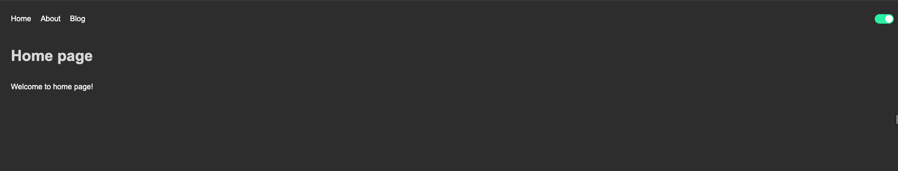

# Dark - light Theme Feature using react

# Dark Theme



# Light Theme


---

## Setup

- Clone the Repo
- switch to folder

```bash
   cd dark-light-mode-react
```

```bash
   yarn
```

```bash
   yarn dev
```
